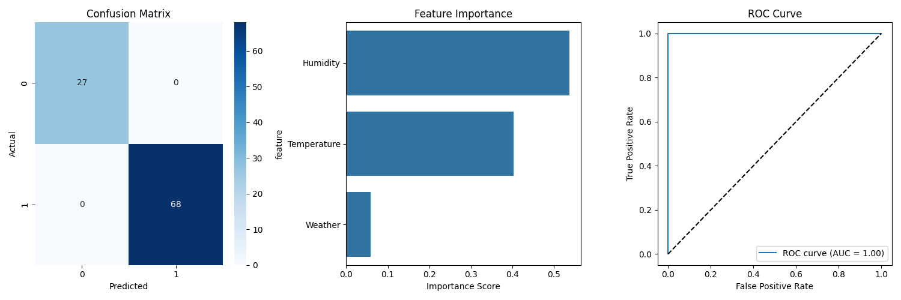

# Football Weather Prediction 🌦️⚽

[](https://www.python.org/downloads/release/python-3100/)
[](https://flask.palletsprojects.com/)
[](https://scikit-learn.org/)
[](https://opensource.org/licenses/MIT)

A machine learning web application that predicts whether it's suitable to play football based on current weather conditions. The application uses a Random Forest Classifier trained on weather data to make intelligent predictions.



## 🌟 Features

- **Smart Predictions**:
  - Weather conditions (Sunny, Cloudy, Rainy)
  - Temperature ranges (Hot, Warm, Mild, Cool)
  - Humidity levels (High, Normal)

- **User-Friendly Interface**:
  - Real-time predictions
  - Interactive web interface
  - Detailed explanations for each prediction
  - Temperature guides in both Celsius and Fahrenheit

- **Technical Features**:
  - Random Forest Machine Learning model
  - RESTful API endpoints
  - Responsive design
  - Cross-browser compatibility

## 🛠️ Technology Stack

- **Backend**:
  - Python 3.10
  - Flask 3.0.0
  - scikit-learn 1.3.0
  - pandas 2.1.0
  - joblib 1.3.2

- **Frontend**:
  - HTML5
  - CSS3
  - JavaScript (jQuery)
  - Font Awesome icons
  - Responsive design

- **Machine Learning**:
  - Random Forest Classifier
  - Label Encoding
  - Cross-validation
  - Model evaluation metrics

## 📋 Prerequisites

- Python 3.10 or higher
- pip (Python package manager)
- Modern web browser
- Git (optional)

## 🚀 Installation

1. **Clone the repository**:
   ```bash
   git clone https://github.com/singhosudip333/Football-Playing-Prediction.git
   cd Football-Playing-Prediction
   ```

2. **Create a virtual environment** (recommended):
   ```bash
   # Windows
   python -m venv venv
   venv\Scripts\activate

   # Linux/Mac
   python3 -m venv venv
   source venv/bin/activate
   ```

3. **Install dependencies**:
   ```bash
   pip install -r requirements.txt
   ```

4. **Run the application**:
   ```bash
   python server.py
   ```

5. **Access the application**:
   - Open your web browser
   - Go to `http://localhost:5000`

## 💡 Usage Guide

1. **Select Weather Condition**:
   - Sunny (Clear sky)
   - Cloudy (Overcast)
   - Rainy (Light to moderate rain)

2. **Choose Temperature Range**:
   - Hot (Above 30°C / 86°F)
   - Warm (25-30°C / 77-86°F)
   - Mild (18-24°C / 64-75°F)
   - Cool (10-17°C / 50-63°F)

3. **Set Humidity Level**:
   - High (Above 60% RH)
   - Normal (40-60% RH)

4. **Get Prediction**:
   - Click "Get Prediction"
   - View the result and explanation
   - See detailed conditions breakdown

## 📁 Project Structure

```
Football-Playing-Prediction/
├── server.py           # Flask application server
├── train_model.py      # Model training script
├── generate_data.py    # Training data generation
├── requirements.txt    # Project dependencies
├── football.csv        # Training dataset
├── model.pkl          # Trained Random Forest model
├── le_*.pkl           # Label encoders for categories
├── templates/
│   └── index.html     # Main webpage template
└── static/
    ├── styles.css     # CSS styling
    └── scripts.js     # Frontend JavaScript
```

## 🔄 Model Training

The prediction model uses a Random Forest Classifier with the following features:
- Weather conditions (categorical)
- Temperature levels (categorical)
- Humidity levels (categorical)

To retrain the model with new data:
```bash
python train_model.py
```

## 📊 Model Performance

The model is evaluated using:
- Cross-validation
- Classification report
- Confusion matrix
- ROC curve
- Feature importance analysis

## 🤝 Contributing

Contributions are welcome! Here's how you can help:

1. Fork the repository
2. Create a feature branch:
   ```bash
   git checkout -b feature/AmazingFeature
   ```
3. Commit changes:
   ```bash
   git commit -m 'Add some AmazingFeature'
   ```
4. Push to the branch:
   ```bash
   git push origin feature/AmazingFeature
   ```
5. Open a Pull Request

## 📝 License

This project is licensed under the MIT License - see the [LICENSE](LICENSE) file for details.

## 👥 Authors

- **Sudip Singho** - *Initial work* - [singhosudip333](https://github.com/singhosudip333)

## 🙏 Acknowledgments

- Weather data patterns
- scikit-learn documentation
- Flask documentation
- Open-source community

## 📧 Contact

For questions or feedback, please open an issue in the GitHub repository. 